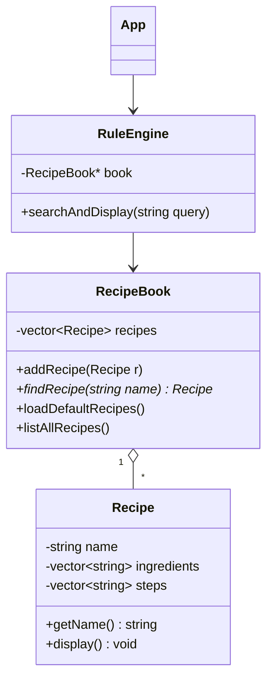
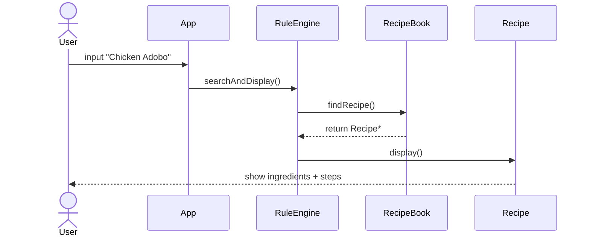

```mermaid
classDiagram
    class Recipe {
        -string name
        -vector~string~ ingredients
        -vector~string~ steps
        +getName() string
        +display() void
    }
    class RecipeBook {
        -vector~Recipe~ recipes
        +addRecipe(Recipe r)
        +findRecipe(string name) Recipe*
        +loadDefaultRecipes()
        +listAllRecipes()
    }
    class RuleEngine {
        -RecipeBook* book
        +searchAndDisplay(string query)
    }
    App --> RuleEngine
    RuleEngine --> RecipeBook
    RecipeBook "1" o-- "*" Recipe
```

```mermaid
sequenceDiagram

    actor User
    User->>App: input "Chicken Adobo"
    App->>RuleEngine: searchAndDisplay()
    RuleEngine->>RecipeBook: findRecipe()
    RecipeBook-->>RuleEngine: return Recipe*
    RuleEngine->>Recipe: display()
    Recipe-->>User: show ingredients + steps

```
